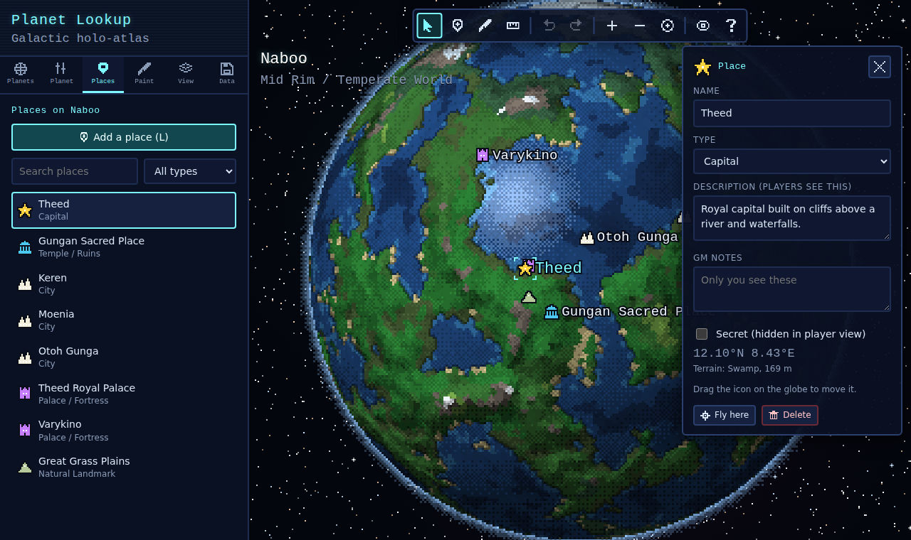

# Planet Lookup

A pixel-art planet atlas for Star Wars tabletop games. Spin a globe, zoom into its cells, pin cities and key locations, and paint the terrain. It works a bit like [Azgaar's Fantasy Map Generator](https://github.com/Azgaar/Fantasy-Map-Generator), but on a sphere.



## What it does

- **154 Star Wars planets ready to go.** 48 famous worlds (Tatooine, Coruscant, Naboo, Hoth, Bespin, Mustafar and more) with key locations such as Mos Eisley, the Jedi Temple and Cloud City, plus 106 worlds of Hutt Space, including every Bootana Hutta world from your campaign notes.
- **A planet type database.** 22 types (desert, ice, ocean, volcanic, city world, gas giant, fungal, dark side, polluted, toxic, belt world and others). Pick a type, roll a seed, tweak sliders, and a whole planet is generated in a fraction of a second.
- **Azgaar-style cells.** Each planet is made of 5,000 to 80,000 cells. Zoom in and turn on the cell grid (G) to see them.
- **Pixelated rendering.** The globe is drawn pixel by pixel at low resolution, then scaled up. Pixel size 1 gives a smooth look.
- **Places.** Add cities, spaceports, bases, temples, cantinas, wrecks and more. Each one has a public description, private GM notes and a "secret" switch.
- **Painting.** Paint biomes, raise or lower land to make islands, seas and mountains, and paint regions (territories with colored borders and labels).
- **Measure distances** in kilometers, with rough travel times on foot, by beast mount, landspeeder, speeder bike and airspeeder.
- **Player view (P)** hides secret places, GM notes and every editing tool, so you can share your screen at the table.
- **Star map (S).** A clickable chart of Hutt Space on the galactic grid, with hyperspace lanes. Bootana Hutta follows the sector map from your campaign notes. Click any world to open it. Every planet also has its own link (`#planet=...`); add `&view=player` to a link and it always opens in player view.
- **Foundry VTT export.** Download a zip with a flat map image, a ready-to-import Foundry scene with map notes for your places, and a journal (Foundry v12 to v14).
- **Saves automatically** in your browser, with undo and redo. You can export and import JSON backups and save the current view as a PNG.

## Running it

It is a static website with no build step and no server code. Browsers block JavaScript modules on pages opened straight from disk (`file://`), so double-clicking `index.html` will not work. Use one of these instead.

### Option 1: GitHub Pages (free, nothing to install)

1. On GitHub, open the repository and go to **Settings > Pages**.
2. Under **Build and deployment**, set **Source** to **Deploy from a branch**.
3. Pick the branch that holds this code, select the `/ (root)` folder, and click **Save**.
4. After a minute or two your atlas is live at `https://<your-username>.github.io/StarWarsPlanetLookup/`.

### Option 2: on your own computer

From the project folder, run any one of these and then open <http://localhost:8080>:

```sh
python3 -m http.server 8080      # Python (preinstalled on macOS and most Linux)
npx serve -l 8080                # Node.js
```

`npm start` runs the Python command for you.

## How to use it

| Action | How |
| --- | --- |
| Spin the planet | Drag (right-drag works in every tool), or use the arrow keys |
| Zoom | Mouse wheel or pinch zooms toward the cursor. Double-click flies in. `+` and `-` also work |
| Add a place | Press `L` (or **Add a place**), then click the globe |
| Edit or move a place | Click it to edit. Drag it to move it. `Del` deletes it |
| Paint | Press `B`, choose a mode in the **Paint** tab, then drag on the globe |
| Measure | Press `M`, then click points. `Esc` or right-click clears them |
| Undo / redo | `Ctrl+Z` / `Ctrl+Y` |
| Layers | `G` cell grid, `C` clouds, `X` cycles the pixel size. The rest are in the **View** tab |
| Star map | `S`, then click a world to open it. Drag to pan, scroll to zoom |
| Player view | `P` |
| Help | `?` |

**Workflow for a new planet:** open **Planets > New planet**, pick a type, then use the **Planet** tab sliders (sea level, temperature, mountains and so on) to get the general shape. After that, paint the details and add places.

**Canon planets:** your changes are saved as your own version. **Planet > Reset to original** brings back the default. Canon rarely gives latitudes, so location coordinates are invented and nudged onto land. Diameters are rough reference values. Edit them freely.

## Hutt Space and the star map

Hutt Space has its own star map (press `S`, or the **Map** buttons in the Planets tab). Worlds sit in their galactic grid squares (R-9 to T-14), joined by the main routes: the Pabol Hutta, the Dead Road, the Pabol Sleheyron, the Ootmian Pabol, the Shag Pabol and others.

**Bootana Hutta** follows the sector map in your campaign notes (`Hutta_DND.pdf`). That map numbers its systems 1 to 21 without a legend, so the numbers were matched to worlds by comparing the hyperlane links Wookieepedia lists (from *The Essential Atlas*) against the lines on the map. Kor Hestilic, for example, is the only world with five links, just like dot 4. Dots 1-3 and 5-9 had fewer clues, so treat those as a best guess. The mapping lives in `BOOTANA_SLOTS` in `js/data/starMaps.js`.

Your campaign worlds (Sakiya, Sakidopa, Sakiduba, Sakifwanna and the rest) use your notes first. Campaign secrets live in GM notes or secret places, so **Player view** hides them. The Godsheart Pulsar is on the map too.

To move things around, open the star map in GM view and press **Edit layout**: drag any world, or click empty space to create a new planet right there. Worlds whose position is unknown wait in the **Location unknown** corner until you drag them into place. **Reset layout** puts everything back.

Research notes: the network policy of the cloud session that built this blocked Wookieepedia pages, so the Hutt Space data was gathered from search-result summaries and then cross-checked. Each planet's **Source** line says where its facts came from. If a detail is wrong for your table, just edit it.

## Foundry VTT (v12 to v14)

**Data > Foundry VTT** downloads a zip containing:

- `<planet>-map.png`: a flat map of the whole planet (equirectangular, 2:1), pixel style.
- `<planet>-scene.json`: a Foundry Scene that uses the image as its background, with a map note for each place and a km scale.
- `<planet>-journal.json`: a Journal Entry with an overview page and one page per place.
- `<planet>.planet.json`: the planet itself, which you can re-import into this app.
- `README.txt`: these steps.

To import it:

1. **Upload the image.** In Foundry, open any file picker (for example **Configure Scene > Background Image**), create the folder `planet-lookup` in your User Data (or whatever folder you typed in the export), and upload the PNG there.
2. **Import the scene.** In the Scenes sidebar, create a scene with any name. Right-click it, choose **Import Data**, and pick the `-scene.json` file.
3. **Import the journal (optional).** Create a journal entry, right-click it, choose **Import Data**, and pick the `-journal.json` file.

Good to know:

- Foundry shows unlinked map notes to every player, so secret places are left out of everything in the zip unless you tick **Include secret places**. GM notes go into the journal and planet file only if you tick **Include GM notes**, and never into the scene.
- The ruler measures km correctly only near the equator, because a flat map stretches the poles.
- If the app is hosted online (for example on GitHub Pages), the journal links back to the spinning globe, opened in player view so secrets stay hidden. You can also try embedding it with **Also embed the globe in the journal**.
- The full planet data is saved in the scene's flags (`starwars-planet-lookup`). A future Foundry module could use that to show the actual rotating globe inside Foundry.

## The planet type database

Types live in [`js/data/planetTypes.js`](js/data/planetTypes.js). You can also add your own in the app, under **Data > Custom planet types**, without touching any code.

Each type is a recipe:

```js
{
  id: 'desert',
  name: 'Desert World',
  gen: { seaLevel: 0.04, temperature: 0.65, moisture: -0.6, mountains: 0.5 },
  rules: [
    { water: true, biome: 'salt_flats' },   // below "sea level": dry salt basins
    { h: [0.72, 1], biome: 'rock' },        // the highest ground
    { h: [0.45, 1], biome: 'badlands' },
    { n: [0, 0.45], biome: 'dunes' },       // patches picked by detail noise
    { biome: 'desert' },                    // everything else
  ],
}
```

Every cell gets four numbers: `h` (elevation, -1 to 1, where 0 is sea level), `t` (temperature, 0 to 1), `m` (moisture, 0 to 1) and `n` (smooth detail noise, 0 to 1). The rules are checked from top to bottom, and the first rule whose ranges all match picks the biome. The biome list is in [`js/data/biomes.js`](js/data/biomes.js). A type can also include a `palette` to recolor biomes, for example `{ "gas_1": "#c0e0ff" }` for a blue gas giant.

## How it works (a map for reading the code)

```
index.html            page layout
css/style.css         all styling
js/main.js            starts the app
js/app.js             the controller: current planet, camera, render loop, editing, undo
js/controls.js        mouse, touch, wheel and keyboard
js/foundry.js         Foundry VTT scene and journal export
js/core/
  rng.js              seeded random numbers (same seed = same planet)
  noise.js            3D simplex noise and fractal layering
  sphere.js           vector math on the unit sphere
  mesh.js             the cell mesh: points on a sphere + Delaunay triangulation
  generator.js        planet generation: elevation, climate, biomes, colors
  types.js            built-in + custom planet types, validation
js/render/
  camera.js           orthographic globe projection
  globeRenderer.js    the per-pixel cell renderer (shading, dithering, borders)
  overlay.js          crisp layer: icons, labels, brush, measuring line
  sprites.js          pixel-art icons for places
  thumbnails.js       small previews for lists
  flatMap.js          flat (equirectangular) map image, used by the Foundry export
js/state/
  store.js            saving to localStorage, export and import
  history.js          undo and redo
  zip.js              a tiny zip writer for the Foundry package
js/ui/                sidebar panels, inspector, dialogs, icons, star map
js/data/              biomes, planet types, planets (canonPlanets.js, huttSpace.js),
                      star maps (starMaps.js), place types
tests/                unit tests (run with `npm test`)
```

The interesting ideas, in the order the data flows:

1. **Cells on a sphere** (`mesh.js`). Points are spread evenly with a "Fibonacci sphere". To find which cells touch, the sphere is flattened with a stereographic projection and triangulated with [Delaunator](https://github.com/mapbox/delaunator).
2. **Seamless terrain** (`generator.js`). Noise is sampled in 3D at each cell's position on the sphere, so there are no seams and no stretched poles. The sea level setting is a percentile, so 0.55 means 55% of cells are underwater.
3. **Pixel rendering** (`globeRenderer.js`). For each pixel of a small image, the renderer works out which point of the sphere it shows, then walks from the previous pixel's cell to the nearest cell (usually zero or one step). That cell's color is shaded, dithered and copied in. The small image is stretched onto the screen without smoothing.
4. **Painting** stores only your changes per cell (`planet.edits`). The generator re-applies them on top of the generated terrain, so a planet is saved as its seed, its settings and your edits.

## Ideas for later

- Dice roller and character sheets, in the spirit of [Galaxy Dice Roller](https://galaxydiceroller.com/)
- Star maps for the rest of the galaxy, with travel times along the lanes
- A Foundry VTT module that shows the spinning globe from the exported scene data
- Rivers, roads and trade routes drawn along the cells
- Night-side city lights for ecumenopolis worlds
- Sharing a planet with players through a read-only link

## Credits

- [Delaunator](https://github.com/mapbox/delaunator) (ISC license) and [robust-predicates](https://github.com/mourner/robust-predicates) (public domain), vendored in `js/vendor/`.
- Inspired by [Azgaar's Fantasy Map Generator](https://github.com/Azgaar/Fantasy-Map-Generator).
- Fonts: [Silkscreen](https://fonts.google.com/specimen/Silkscreen) and [VT323](https://fonts.google.com/specimen/VT323) from Google Fonts.

Star Wars and all related names are trademarks of Lucasfilm Ltd. This is an unofficial fan project for personal tabletop use.
